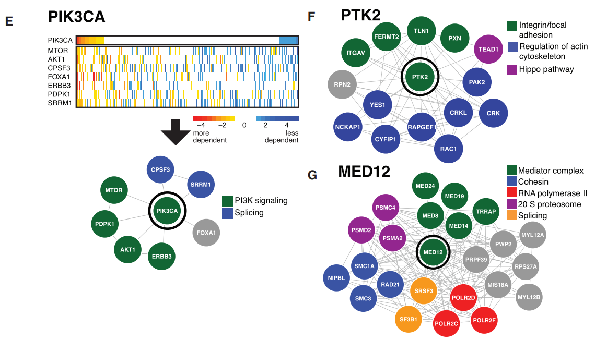

## RNAi screening
Tsherniak, A., Vazquez, F., Montgomery, P. G., Weir, B. A., Kryukov, G., Cowley, G. S., … Hahn, W. C. (2017). Defining a Cancer Dependency Map. Cell, 170(3), 564-576.e16. https://doi.org/10/gbrhmb

integrated a large number of genome-scale RNAi-based loss-of-function screens to facilitate the interrogation of gene function.

 - developed an analytical approach that quantifies on- and off-target effects of each RNAi reagent，可以用吗？？？
 - gene networks for PTK2 (F) and MED12 (G)

 a
 

Q1: screening的方法，套路在哪里？
Q2:

### 好词好句
Multiple genetic or epigenetic changes are required to program the malignant state.
