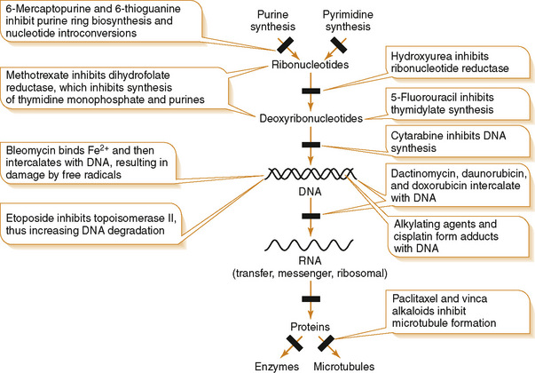
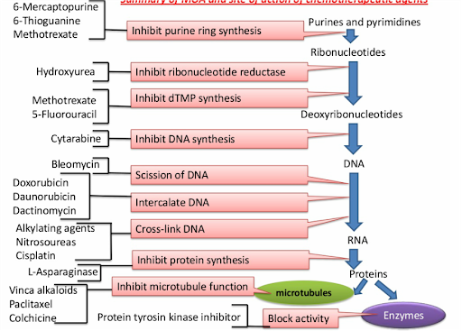
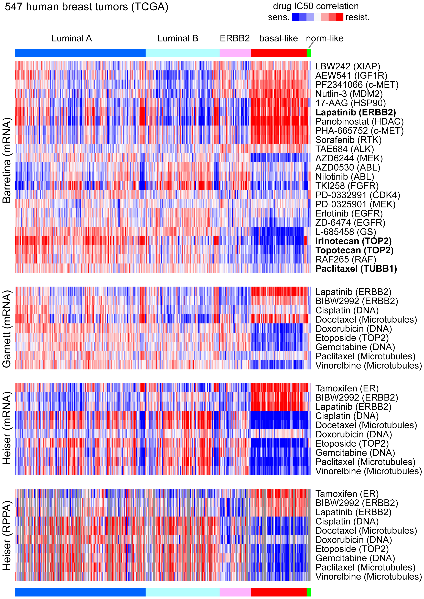

抗癌药物分类：

按照靶点从遗传物质合成到蛋白质合成这一过程分类
1. 嘌呤和嘧啶-核糖核酸
嘌呤环合成抑制
2. 核糖核酸 - DNA
 抑制DNA合成
3. DNA - RNA
   a. Scission of DNA
   b. Intercalate DNA
    This class of agents includes doxorubicin, daunorubicin, and epirubicin表柔比星, which are often used as adjuvant therapy in breast cancer
     - Doxorubicin
     - Daunorubicin 红比霉素,柔红霉素(用作抗肿瘤药)
     - Dactinomycin 更生霉素(一种抗肿瘤的抗生素)

  c. Cross link DNA
 This class of agents includes doxorubicin, daunorubicin, and epirubicin表柔比星, which are often used as adjuvant therapy in breast cancer
烷基化物：alkylating agents
癌细胞迅速繁殖，它们吸收高浓度的烷基化剂，它们的DNA经常暴露在外，很少修复
因此癌细胞比其他大多数细胞死亡的频率更高，其他细胞有时间修复受损的DNA并且不会累积相同浓度的烷基化剂。

亚硝基脲nitrosourea：与致癌机理是非常接近的，都能够使DNA碱基发生烷化，进一步形成DNA股间交联。
顺铂

4. RNA - Protein
 - inhibit protein synthesis

5. Protein: microtubule
inhibit microtubule function
vinca alkaloids 长春花生物碱
paclitaxel
colchicine 秋水仙碱

6. Protein: enzymes

## 1. 嘌呤和嘧啶-核糖核酸
嘌呤环合成抑制
## 2. 核糖核酸 - DNA
 抑制DNA合成
## 3. DNA - RNA
1. Scission of DNA
2. Intercalate DNA
This class of agents includes doxorubicin, daunorubicin, and epirubicin表柔比星, which are often used as adjuvant therapy in breast cancer
     - Doxorubicin
     - Daunorubicin 红比霉素,柔红霉素(用作抗肿瘤药)
     - Dactinomycin 更生霉素(一种抗肿瘤的抗生素)

3. Cross link DNA
 - 烷基化物：alkylating agents
癌细胞迅速繁殖，它们吸收高浓度的烷基化剂，它们的DNA经常暴露在外，很少修复
因此癌细胞比其他大多数细胞死亡的频率更高，其他细胞有时间修复受损的DNA并且不会累积相同浓度的烷基化剂。

 - 亚硝基脲nitrosourea：与致癌机理是非常接近的，都能够使DNA碱基发生烷化，进一步形成DNA股间交联。
 - 顺铂

4. RNA - Protein
 - inhibit protein synthesis

5. Protein: microtubule
inhibit microtubule function
vinca alkaloids 长春花生物碱
paclitaxel
colchicine 秋水仙碱

6. Protein: enzymes

[Drug sensitivity correlation patterns within human breast tumors]
药物IC50与基因表达建立正负相关性：
luminal A 好像多数是红色的？

https://journals.plos.org/plosone/article?id=10.1371/journal.pone.0071158
